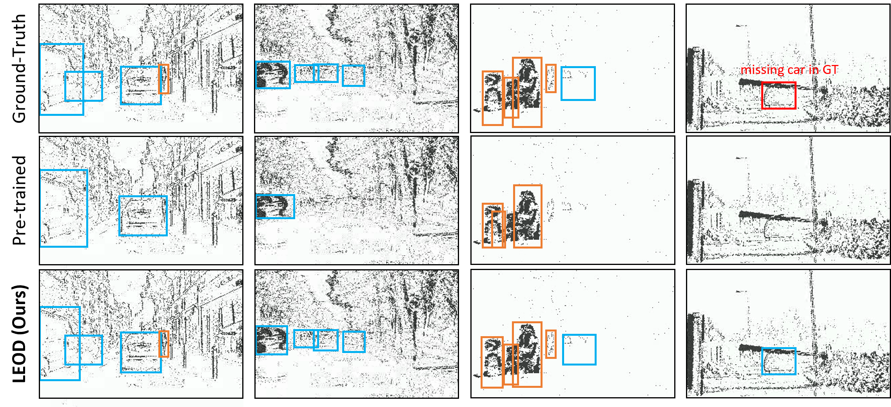
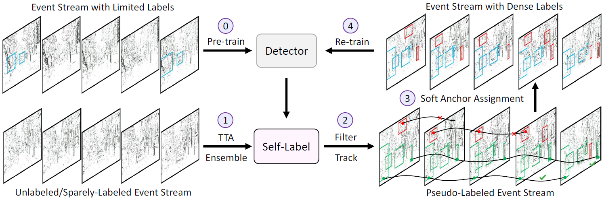

# LEOD

This is the official Pytorch implementation for our CVPR 2024 paper:

[**LEOD: Label-Efficient Object Detection for Event Cameras**](https://arxiv.org/abs/2311.17286)<br/>
[Ziyi Wu](https://wuziyi616.github.io/),
[Mathias Gehrig](https://magehrig.github.io/),
Qing Lyu,
Xudong Liu,
[Igor Gilitschenski](https://tisl.cs.utoronto.ca/author/igor-gilitschenski/)<br/>
_CVPR'24 |
[GitHub](https://github.com/Wuziyi616/LEOD?tab=readme-ov-file#leod) |
[arXiv](https://arxiv.org/abs/2311.17286)_

<p align="center">
  
</p>

## TL;DR

[Event cameras](https://tub-rip.github.io/eventvision2023/#null) are bio-inspired low-latency sensors, which hold great potentials for safety-critical applications such as object detection in self-driving.
Due to the high temporal resolution (>1000 FPS) of event data, existing datasets are annotated at a low frame rate (e.g., 4 FPS).
As a result, models are only trained on these annotated frames, leading to sub-optimal performance and slow convergence speed.
In this paper, we tackle this problem from the perspective of weakly-/semi-supervised learning.
We design a novel self-training framework that pseudo-labels unannotated events with reliable model predictions, which achieves SOTA performance on two largest detection benchmarks.

<p align="center">
  
</p>

## Install

This codebase builds upon [RVT](https://github.com/uzh-rpg/RVT).
Please refer to [install.md](./docs/install.md) for detailed instructions.

## Experiments

**This codebase is tailored to [Slurm](https://slurm.schedmd.com/documentation.html) GPU clusters with preemption mechanism.**
There are some functions in the code (e.g. auto-detect and load previous checkpoints) which you might not need.
To reproduce the results in the paper, please refer to [benchmark.md](docs/benchmark.md).

## Citation

Please cite our paper if you find it useful in your research:
```bibtex
@inproceedings{wu2023leod,
  title={LEOD: Label-Efficient Object Detection for Event Cameras},
  author={Wu, Ziyi and Gehrig, Mathias and Lyu, Qing and Liu, Xudong and Gilitschenski, Igor},
  booktitle={CVPR},
  year={2024}
}
```

## Acknowledgement

We thank the authors of [RVT](https://github.com/uzh-rpg/RVT), [SORT](https://github.com/abewley/sort), [Soft Teacher](https://github.com/microsoft/SoftTeacher), [Unbiased Teacher](https://github.com/facebookresearch/unbiased-teacher) and all the packages we use in this repo for opening source their wonderful works.

## License

LEOD is released under the MIT License. See the LICENSE file for more details.

## Contact

If you have any questions about the code, please contact Ziyi Wu dazitu616@gmail.com
